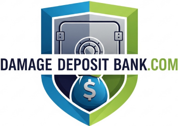

Here’s a professional and complete `README.md` tailored for your **Damage Deposit Bank** project:

---

````markdown
# 💰 Damage Deposit Bank

A secure rental deposit management platform built with **Next.js**, **TypeScript**, and **Tailwind CSS**. Designed for renters, landlords, and admins to manage rental deposits through e-transfer proof, role-based chat, and admin verification.



---

## 🚀 Features

- 🔐 **Role-Based Authentication** (Renter, Landlord, Admin)
- 🏠 **House-Based Chat** with subject threads
- 💸 **e-Transfer Proof Upload** & Verification
- 🛡️ **Admin Tools** for house creation and deposit approvals
- 🎨 Fully branded UI based on the official Damage Deposit Bank logo

---

## 🛠 Tech Stack

- **Frontend:** [Next.js](https://nextjs.org/), [React](https://reactjs.org/)
- **Styling:** [Tailwind CSS](https://tailwindcss.com/)
- **Backend:** Node.js API Routes
- **Database:** MongoDB (via Mongoose or Prisma)
- **Authentication:** NextAuth.js or custom JWT logic
- **Chat:** Socket.io or REST-based threaded messaging
- **File Upload:** Cloudinary or local file system
- **AI (Optional):** [Taskmaster AI](https://taskmaster.ai) integration for deposit verification and assistant features

---

## 📦 Getting Started

### 1. Clone the repository

```bash
git clone https://github.com/your-username/damage-deposit-bank.git
cd damage-deposit-bank
```
````

### 2. Install dependencies

```bash
npm install
```

### 3. Set up environment variables

Create a `.env.local` file in the root:

```env
NEXTAUTH_SECRET=your_secret
MONGODB_URI=your_mongo_connection_string
NEXT_PUBLIC_EMAIL_USERNAME=your_email
NEXT_SECRET_EMAIL_PASSWORD=your_password
NEXTAUTH_URL=http://localhost:3000
```

### 4. Run the development server

```bash
npm run dev
```

Open [http://localhost:3000](http://localhost:3000) to view the app.

---

## 🧱 Project Structure

```
/pages
  /api        ← Backend API routes
  /auth       ← Login, Register, Forgot Password
  /dashboard  ← Role-based dashboard
/components   ← Reusable UI components
/models       ← MongoDB/Mongoose schemas
/utils        ← Email service, pricing rules, auth
/public       ← Static assets (logo, favicon, etc.)
```

---

## 🧪 TODO / Roadmap

- [ ] Chat system with per-house, per-subject logic
- [ ] E-transfer proof upload (image/pdf)
- [ ] Admin verification dashboard
- [ ] AI integration with Taskmaster for deposit validation
- [ ] Email notifications on verification/update

---

## 🖼️ UI Preview

Coming soon...

---

## 🙌 Contributing

Feel free to open issues or submit pull requests. Contributions are welcome!

---

## 📄 License

This project is licensed under the MIT License.

---

## 🧠 Author

Built with ❤️ by [Samil Abud](https://github.com/samilabud)

```

```
